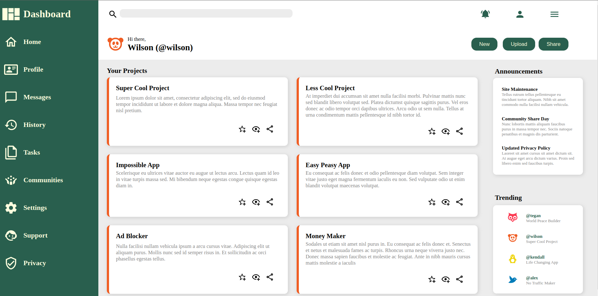
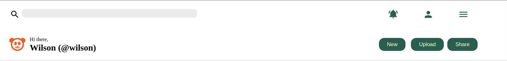
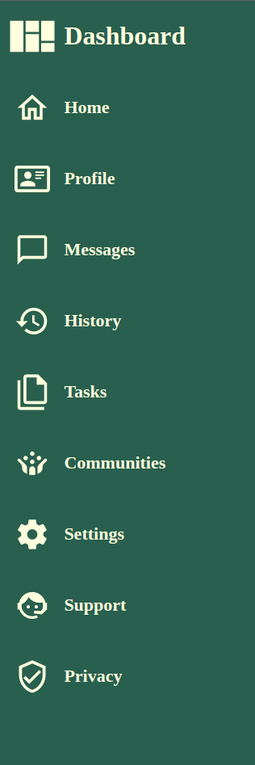
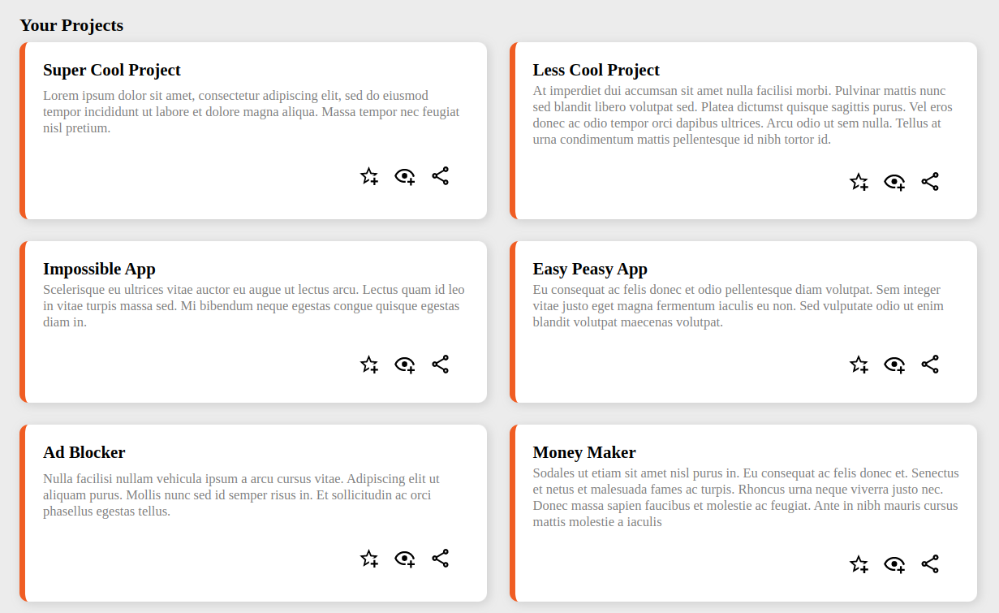
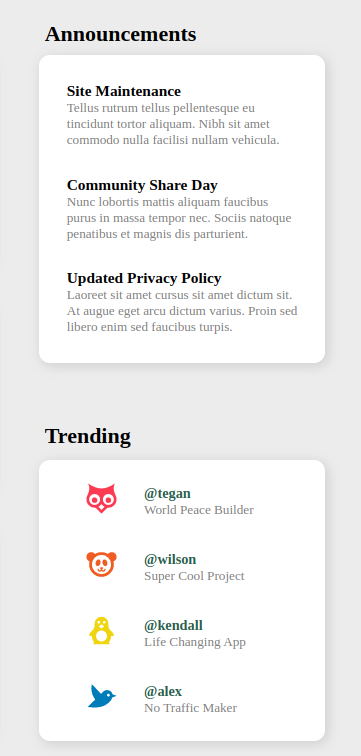

# **Admin Dashboard**

## **Project Description**

In this project I learned how to build an admin dashboard using CSS Grid.
CSS Grid is a grid-based layout system in CSS that helps you to simplify the process of laying out a webpage or web application.

The full implementation of the project can be found [here](https://wilsonsiaw.github.io/admin-dashboard/).

## **Technologies Used**

## **Features**

The main idea behind this project was to learn how to lay out a page using nothing
but CSS Grid.

There were three major sections in the dashboard that needed to be laid out. These sections were:

**The header**:

**The sidebar**:

**Main Content Cards**:

**Side Content Cards**

The key to laying out the different sections and elements within the sections was learning how to nest grids or create grids within grids.

## **What I learned**

In this project, I learned how to use CSS Grid to lay out a webpage or web application. I learned how to create a grid container and grid tracks. Moreover, I learned different ways to define or set grid track sizes. I also learned the difference between implicit and explicit grids. 

In addition to this, I learned how to postion grid items within a grid using grid-column-start, grid-column-end, grid-row-start and grid-row-end. I also learned how to acccomplish the same task using grid-template-areas and grid-area.

Finally, I learned how to create a grid within a grid or nest grids.

## **Challenges**

As mentioned above, the key to completing this project was figuring out how to create grids within grid. This was the most challenging aspect of the project.

The solution to this challenge was learning that you can create a grid container within another grid container. Doing this helps to nest grids within grids, thereby creating grid items that you can lay out within a parent or sub container.
